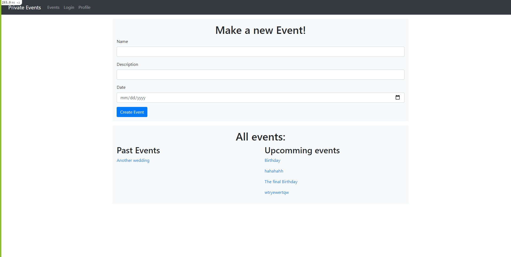

# The Private-Events

Create a page similitar to Eventbrite which allows users to create events and then manage user signups.

## About

Users can create events and send invitations and parties. Events take place at a specific date and location.

In this project we:
- Made the base of the events application that users can use to set events, invites, and attend parties.
- Made models for users and events.
- Made the associations between models.
- Made a simple design for the interface.
- Made a simple login - sign-up form.

## Usage

- Clone the repo "https://github.com/afcastaneda223/private-events".
- Write "rails s"

## Technologies

- Ruby
- Rails
- SQLite3
- VSCode
- Bootstrap

## Authors

👤 **Andres Felipe Castañeda Ramos**

- Github: [@afcastaneda223](https://github.com/afcastaneda223)
- Twitter: [@afcastaneda](https://twitter.com/afcastaneda)
- Linkedin: [Andres Felipe Castañeda](www.linkedin.com/in/andres-castaneda223)

👤 **Mohamed Atef**

- GitHub: [@mohamed-js](https://github.com/Mohamed-js)
- Twitter: [@demovejetta](https://twitter.com/demovejetta)
- LinkedIn: [LinkedIn](https://www.linkedin.com/in/mohamed-js/)

## 🤝 Contributing

Contributions, issues, and feature requests are welcome!

## Show your support

Give a ⭐️ if you like this project!

### Acknowledgements

- Microverse
- The Odin Project

## 📝 License

This project is [MIT](./LICENSE) licensed.
